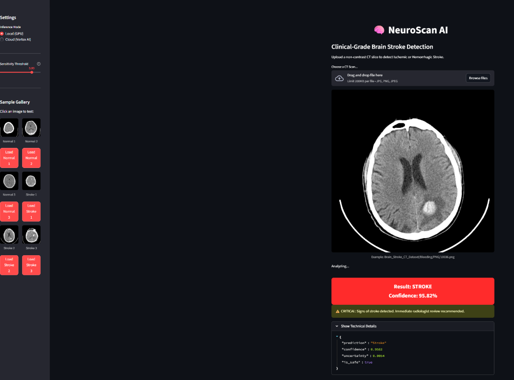

# Brain Stroke CT Classification System
> **Clinical-Grade AI for Rapid Ischemic & Hemorrhagic Stroke Detection**

[](https://www.python.org/downloads/)
[](https://pytorch.org/)
[](https://developer.nvidia.com/cuda-toolkit)
[](https://wandb.ai/)
[](https://cloud.google.com/run)

## 🏥 Project Overview
This project implements an end-to-end MLOps pipeline for the binary classification of brain CT scans (Normal vs. Stroke), designed to demonstrate **clinical-grade reliability** and **production-readiness**.

**Key Technical Features:**
*   **Deep Learning Core**: Built on `PyTorch 2.5+` and `timm`, utilizing **EfficientNet** backbones for state-of-the-art feature extraction.
*   **Hardware Acceleration**: Optimized for NVIDIA RTX 50-series GPUs using **Automatic Mixed Precision (AMP)** and **CUDA 12.8** to maximize training throughput and memory efficiency.
*   **Production Deployment**: Fully containerized using **Docker** and deployed as a serverless monolithic microservice on **Google Cloud Platform (Cloud Run)**.
*   **MLOps & Tracking**: Integrated with **Weights & Biases (W&B)** for real-time experiment tracking, model checkpointing, and hyperparameter optimization.
*   **Clinical Safety**: Features a custom "Safety Layer" implementing **Monte Carlo Dropout** for uncertainty estimation and **Out-of-Distribution (OOD)** saturation checks to reject invalid inputs.


> **[🔴 Try the Live Demo here](https://neuroscan-app-771960206668.us-central1.run.app)**

**Key Objectives:**
*   **Clinical Literacy**: Primary metric is **F2 Score** (recall-weighted) rather than accuracy.
*   **High Performance**: Optimized for RTX 50-series GPUs using Mixed Precision (AMP) and CUDA 12.8.
*   **Safety**: Includes uncertainty estimation (Monte Carlo Dropout) and saturation checks to reject non-medical images.
*   **Scalability**: Deployed as a scalable **Monolithic Container** on Google Cloud Run.

---

## ⚡ Tech Stack & Engineering
We leverage a modern MLOps stack to ensure reproducibility, scalability, and transparency:

### 🔬 Deep Learning & Data Science
*   **Core Framework**: `PyTorch 2.5+`, `Torchvision`
*   **Architectures**: `timm` (EfficientNet-B4 Backbone via **Transfer Learning** on ImageNet), Custom Classification Heads
*   **Optimization**: Automatic Mixed Precision (AMP) for fp16 training, Label Smoothing, AdamW
*   **Data Handling**: Stratified Shuffle Splits, Class Imbalance Management
*   **Safety Layer**: 
    *   **OOD Detection**: Saturation analysis to reject non-CT images.
    *   **Uncertainty**: Monte Carlo Dropout for epistemic uncertainty quantification.

### 🛠️ MLOps & Engineering
*   **Experiment Tracking**: `Weights & Biases (W&B)` - Real-time loss monitoring, artifact storage, and Hyperparameter Sweeps (Bayesian/Random).
*   **Deployment**: `Streamlit` (Frontend), `FastAPI` (Inference Handler - planned), `Docker` (Containerization).
*   **Infrastructure**: Local Development on **WSL 2** with direct GPU Access; Production target on **Google Cloud Run**.

---

## 🛠️ Usage

### 1. Environment Setup
Optimized for **NVIDIA RTX 5080** / **CUDA 12.8**.

```bash
# 1. Create Environment
conda create -n brain-stroke-dl python=3.10
conda activate brain-stroke-dl

# 2. Install PyTorch (Specific CUDA 12.8 Index)
pip install torch torchvision --index-url https://download.pytorch.org/whl/cu128

# 3. Install Dependencies
pip install -r requirements.txt
```

### 2. Training
Run the dedicated training script. This defaults to `EfficientNet-B4` and logs to W&B.

```bash
# Standard Training
python train_cls.py

# Arguments are handled via standard defaults or W&B Config (during sweeps)
```

**Hardware Acceleration**:
The training loop uses `torch.amp.autocast('cuda')` for Automatic Mixed Precision. This reduces VRAM usage by ~40% and speeds up training on Tensor Cores without losing convergence stability.

### 3. Hyperparameter Sweeps (W&B)
We use Random Agent search to optimize Learning Rate, Batch Size, and Dropout.

```bash
# Initialize Sweep
wandb sweep configs/sweep.yaml

# Run Agent
wandb agent <SWEEP_ID>
```

### 4. Evaluation
Evaluate the clinically-relevant metrics (F2, Sensitivity, Specificity) on the held-out test set.

```bash
python eval_cls.py --model best_model.pth --split test
```

---

## 🛡️ Safety & Robustness
Medical AI must be trustworthy. This repo implements a "Safety Layer" (`utils/safety.py`) invoked before inference:

1.  **OOD Detection**: Rejects inputs with high channel variance (likely RGB natural images, not grayscale CTs).
2.  **Uncertainty Estimation**: Uses **Monte Carlo Dropout** inference (running multiple forward passes with dropout enabled) to quantify epistemic uncertainty.

---

---

## 🚀 Deployment (Docker & Cloud Run)
The application is containerized and hosted on Google Cloud Run.

**Live Demo**: [https://neuroscan-app-771960206668.us-central1.run.app](https://neuroscan-app-771960206668.us-central1.run.app)

*  **Frontend**: A **Streamlit** dashboard (containerized via Docker) allowing clinicians to drag-and-drop scans.

### 🐳 Docker
Build and run the container locally:

```bash
# Build
docker build -f deploy/Dockerfile -t stroke-app:v1 .

# Run (Mapped to port 8501)
docker run -p 8501:8501 stroke-app:v1
```
---

## 📂 Visualizations
Check `notebooks/eda.ipynb` for detailed analysis of the dataset:
*   Class Imbalance verification.
*   Pixel Intensity Histograms (Hounsfield Unit approximations).
*   Sample Grid Visualization.

---

**Author**: Thomas DiGregorio
**License**: MIT
